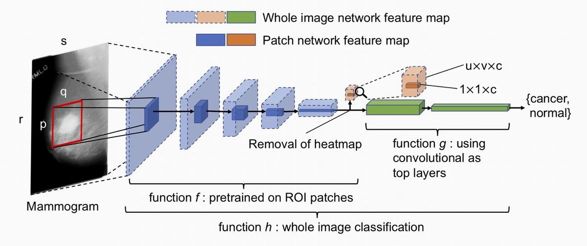

# Validate and Improve Breast Cancer AI Approach

 **Disclaimer:** Some code contained in this repository was implemented or modified based on Keras APIs and some public GitHub repos:

 - [https://github.com/lishen/end2end-all-conv](https://github.com/lishen/end2end-all-conv)

 - [https://github.com/nyukat/GMIC](https://github.com/nyukat/GMIC)

As a result, such code may be subjected to certain types of software licences. For any commercialisation attempts that involves using such code in this repo, please have a thorough check on licences. We are not responsible for any consequences due to licence violations. 

## Introduction
This repo hosts the implementation of breast cancer classification models for the MDPP project of "Validate and Improve Breast Cancer AI Approach". The code in this repo implements three types of classification frameworks, as described in the technical report.

1. global framework + Keras implemenation of [InceptionResNet-V2](https://arxiv.org/abs/1602.07261) [1] model, [EfficientNet](https://arxiv.org/abs/1905.11946) [2] model, and [NASNetLarge](https://arxiv.org/abs/1707.07012) [3] model
2. global+local framework 1: The method described in [Deep Learning to Improve Breast Cancer Detection on Screening Mammography](https://www.nature.com/articles/s41598-019-48995-4) [4]

1. global+local framework 2: The method described in [An interpretable classifier for high-resolution breast cancer screening images utilizing weakly supervised localization](https://arxiv.org/abs/1906.02846) [5]

Except for global+local framework 1, other frameworks/methods are implemented based on Python 3.7, whereas global+local framework 1 is implemented using Python 2.7

## Data preparation and pre-processing

#### Prerequisites

* Python (3.7)
* NumPy (1.18.5)
* Pandas (0.22.0)
* Opencv-python (3.4.2)
* Pydicom (2.0.0)

In order to run the code of data preparation and pre-processing, you should first install conda in your environment, then install the required dependencies by running

    pip install -r requirements_data_processing.txt

Data preparation includes:

 - Convert DICOM data into 'PNG' images
 - Collect image information(label, side, view, modality, monochrome etc.) from DICOM data
 - Generate original SV training and test data from the file lists obtained from Peter
 - Split the original SV data into *k* folds of training data (90% of the original data) and test data(10% of the test data) to validate the stability of classifier under a *k*-fold stratified cross-validation setting

Data pre-processing (optional for training classification model) includes:

 - Background cropping & text removal

 - Contrast adjustment
 
 Code of data preparation and pre-processing is available in folder `"Utilities"`. More information of the code usage can be found in `Utilities\Readme.md`.

## Model training and evaluation

### 1. Global framework

In the global framework, we explored three existing DNN models (InceptionResNet-V2, EfficientNetB6, and NASNetLarge) implemented in Keras package. Code of global framework is available in folder `Global_framework`

#### Prerequisites

* Python (3.7)
* Tensorflow (2.3.1)
* NumPy (1.18.5)
* Matplotlib (3.3.2)
* Scikit-learn (0.23.2)

#### How to run the code
You need to first install conda in your environment. Before running the code, you should first run 

    pip install -r requirements_global_framework.txt

to install the required dependencies. Once you have installed all the dependencies, you can run the script `train_mammo_classifier.sh` in  folder `"Global_framework"` to train the mammogram classifier

    bash Global_framework/train_mammo_classifier.sh

The following variables defined in `train_mammo_classifier.sh` can be modified as required
* `datapath`: The path where the training and test data are saved
* `epochs`: Training epochs
* `lr`: Learning rate
* `bs`: Batch size
* `is`: The input size to the model.
* `fl`: Freezing layer of the model.
* `pretrained`: Whether to use the pre-trained model on ImageNet
* `model`: Which one of the Keras implemented DNN models to use. Valid values include {'inception_resnet_v2', 'EfficientNet', 'NASNet'}

You can run the script `train_patch_classifier.sh` in folder `"Global_framework"` to train the patch classifier

    bash Global_framework/train_patch_classifier.sh

The following variables defined in `train_patch_classifier.sh` can be modified as required
* `datapath`: The path where the training and test data are saved
* `epochs`: Training epochs
* `lr`: Learning rate
* `bs`: Batch size
* `is`: The input size to the model.
* `fl`: Freezing layer of the model.
* `pretrained`: Whether to use the pre-trained model on ImageNet or not
* `model`: Which one of the Keras implemented DNN models to use. Valid values include {'resnet50', 'EfficientNet', 'NASNet'}

To fine-tune the mammogram classifier, first run

    python Global_framework/generate_finetuning_mammo_classifier_script.py
to generate training scripts with different hyper-parameter settings in folder `"Global_framework/fine_tune_scripts"`. Then run the relevant script to train the mammogram classifier with specific hyper-parameter setting. For example,

    bash Global_framework/train_mammo_classifier.sh

After training finishes, you can run the script `model_evaluate.sh` in folder `"Global_framework"` to evaluate the model performance by calculating classification accuracy, AUC, and draw ROC curve

    bash Global_framework/model_evaluate.sh

The following arguments defined in `model_evaluate.sh` can be modified as required
* `type`: The type of classifiers. Valid values are {'mammo', 'patch'}
* `model_dir`: The directory where the trained model is saved
* `datapath`: The path whether the test data is saved
* Arguments `epochs`, `lr`, `bs`, `is`, `fl`, `pretrained`, `model` denote the value of hyper-parameters (i.e., training epochs, learning rate, batch size, input size, freeze layer, whether pre-trained model is used, and model architecture) used to train the classifier
* `thresh`: threshold used to determine the true and false prediction

### 2. Global+local framework 1
In global+local framework 1, we tried the implementation of an end-to-end classifier using patch-level and image-level information for breast cancer classification, proposed in [4]. The framework of this method is shown in the following figure.

The code we used is cloned from the public GitHub repo described in `Disclaimer` Section, and it is available in folder `"Global_local_framework_1"`
#### Prerequisites

* Python (2.7)
* Tensorflow-gpu (1.5.0)
* Keras(2.0.8)
* Pydicom (1.4.2)
* Opencv-python (4.2.0)
* Scikit-learn (0.23.2)
* Pillow (6.2.2)
* Pandas (0.24.2)
* h5py (2.10.0)

#### How to run the code
You need to first install conda in your environment. Before running the code, you should first run 

    pip install -r requirements_ global_local_framework_1.txt

to install the required dependencies. Once you have installed all the dependencies, you can run the script `Global_local_framework_1/retrain_mammo_classifier_featurewise-normalise.sh` 

    bash Global_local_framework_1/retrain_mammo_classifier_featurewise-normalise.sh

to re-train the whole image classifiers initialised with the pre-trained models obtained from the DDSM dataset (pre-trained models can be downloaded from [https://github.com/lishen/end2end-all-conv](https://github.com/lishen/end2end-all-conv)).

The following important arguments defined in `retrain_mammo_classifier_featurewise-normalise.sh` can be modified as required
* `TRAIN_DIR`: The directory where the training data is saved
* `VAL_DIR`: The directory where the validation data is saved
* `TEST_DIR`: The directory where the test data is saved
* `RESUME_FROM`: The location of pre-trained whole image classifiers obtained from DDSM dataset
* `BEST_MODEL`: The path to save the best re-trained model that achieves the highest AUC on validation data
* `FINAL_MODEL`: The path to save the final re-trained model
* `img-size`: The input size to the pre-trained model
* `rescale_factor`: If you use 8-bit images for training, set this value to 1. If you use 16-bit images for training, set this value to 0.003891 (255/65535)
* `featurewise-center`: Whether to normalise images or not. Invalid values are {'featurewise-center', 'no-featurewise-center'}
* `featurewise-mean`: The mean intensity of all train data
* `batch-size`: Batch size for training
* `nb-epoch`: Epochs for training the top layers
* `all-layer-epochs`: Epochs for training all layers
* `optimizer`: Optimiser used during the training

**Note:** More details and examples on how to train patch-level and image-level classifiers can be found in Reference [4] and [https://github.com/lishen/end2end-all-conv](https://github.com/lishen/end2end-all-conv)

After training finishes, you can run the script `model_eval.sh` in folder `"Global_local_framework_1"` 

    bash Global_local_framework_1/model_eval.sh

to evaluate the model performance by calculating classification accuracy, and AUC.

The following arguments defined in `model_eval.sh` can be modified as required
* `IMAGE_PATH`: The path where the test data is saved
* `MODEL_PATH`: The path where the re-trained model is saved
* `rescale_factor`: If you use 8-bit images for training, set this value to 1. If you use 16-bit images for training, set this value to 0.003891 (255/65535)
* `featurewise-mean`: The mean intensity of all train data
* `img-size`: The input size to the pre-trained model
 
### 3. Global+local framework 2
In global+local framework 2, we tried the implementation of Globally-aware Multiple Instance Classifier (GMIC) [5] for mammogram interpretation. This method fuses global context and local details of mammograms for prediction the presence/absence of benign/malignant lesions. The framework of this method is shown in the following figure.

The code we used and modified is based on the public GitHub repo described in `Disclaimer` Section, and it is available in folder `"Global_local_framework_2"`

#### Prerequisites
* Python (3.7)
* PyTorch (1.2.0)
* torchvision(0.4.0)
* NumPy (1.18.2)
* SciPy (1.4.1)
* h5py (2.10.0)
* imageio (2.8.0)
* Pandas (1.0.5)
* tqdm (4.45.0)
* Opencv-python (4.2.0)
* Matplotlib (3.2.1)
* Scikit-learn (0.23.2)
* albumentations (0.5.0)

#### How to run the code
You need to first install conda in your environment. Before running the code, you should first run 

    pip install -r requirements_ global_local_framework_2.txt

to install the required dependencies. Once you have installed all the dependencies, you can run the script `split_datasets.sh` in folder `Global_local_framework_2`

    bash Global_local_framework_2/split_datasets.sh

to automatically split the training data into training and validation sets, and generate file lists for training, validation and test data.

The following arguments defined in `split_datasets.sh` can be modified as required
* `train_cancer_path`: The path where the training data of cancer images is saved
* `train_normal_path`: The path where the training data of normal images is saved
* `test_cancer_path`: The path where the test data of cancer images is saved
* `test_normal_path`: The path where the test data of normal images is saved
* `val_size`: The size of validation set split from the training data (default value = 0.1)
* `train_csv_path`: The path to save the filename list of the training set
* `val_csv_path`: The path to save the filename list of the validation set
* `test_csv_path`: The path to save the filename list of the test set

After you prepared the training, validation and test sets, you can run relevant scripts in `Global_local_framework_2` folder to re-train the image classifiers on SV data using the pre-trained models provided in[ https://github.com/nyukat/GMIC/tree/master/models](https://github.com/nyukat/GMIC/tree/master/models)

For example, you can run the script `retrain_model_1.sh` in folder `Global_local_framework_2`

    bash Global_local_framework_2/retrain_model_1.sh

to re-train the pre-trained model corresponding to parameter setting 1.

The following arguments defined in `retrain_model_1.sh` can be modified as required
* `model_path`: The path where the pre-trained model is saved
* `data_path`: The path where the training data is saved
* `save_model_path`: The path where to save the re-trained model
* `train_data_csv`: The path where the filename list of the training set is saved
* `val_data_csv`: The path where the filename list of the validation set is saved
* `test_data_csv`: The path where the filename list of the test set is saved
* `epochs`: Training epochs
* `lr`: Learning rate
* `lr_step`: The frequency to decay the learning rate (i.e., decay the learning rate every `lr_step` epochs)
* `bs`: Batch size
* `augmentation`: Whether to perform data augmentation during the training stage

To evaluate the performance of the re-trained model, you can run the script `model_evaluation.sh` in folder `Global_local_framework_2`

    bash Global_local_framework_2/model_evaluation.sh

to evaluate the classification accuracy, and AUC.

To visualise the salience map of malignant regions predicted by the classification model, you can run the script `visualise_salience_map.sh` in folder `Global_local_framework_2`

    bash Global_local_framework_2/visualise_salience_map.sh

The following arguments defined in `visualise_salience_map.sh` can be modified as required
* `model_path`: The path where the re-trained model is saved
* `data_path`: The path of evaluated images to be visualised
* `data_csv_path`: The path of the filename listed in `data_path`
* `mask_dir`: The path where the ground-truth malignant maps of evaluated images is saved
* `output_path`: The path where the salience maps to be saved
* `bs`: Batch size
* `percent_t`: Hyper-parameter of the classification model

**Note:** More details and examples on how to train and visualise the salience map generated from the classification model can be found in Reference [5] and [https://github.com/nyukat/GMIC](https://github.com/nyukat/GMIC)

### References
**1. Inception-v4, Inception-ResNet and the Impact of Residual Connections on Learning**\
Szegedy C., Ioffe S., Vanhoucke V., Alemi A. AAAI Conference on Artificial Intelligence (AAAI), pp. 4278-4284, 2017.

**2. EfficientNet: Rethinking Model Scaling for Convolutional Neural Networks**\
Tan M., Le Q.V. International Conference on Machine Learning (ICML), pp. 6105-6114, 2019.

**3. Learning Transferable Architectures for Scalable Image Recognition**\
Zoph, B., Vasudevan, V., Shlens, J., and Le, Q. V. IEEE Conference on Computer Vision and Pattern Recognition (CVPR), 2018.

**4. Deep Learning to Improve Breast Cancer Detection on Screening Mammography**\
Shen L., Margolies L.R., Rothstein J.H. et al, Scientific Reports 9, 12495, 2019.

**5. An interpretable classifier for high-resolution breast cancer screening images utilizing weakly supervised localization**\
Shen Y., Wu N., Phang J., et al, arXiv:2002.07613, 2020.

